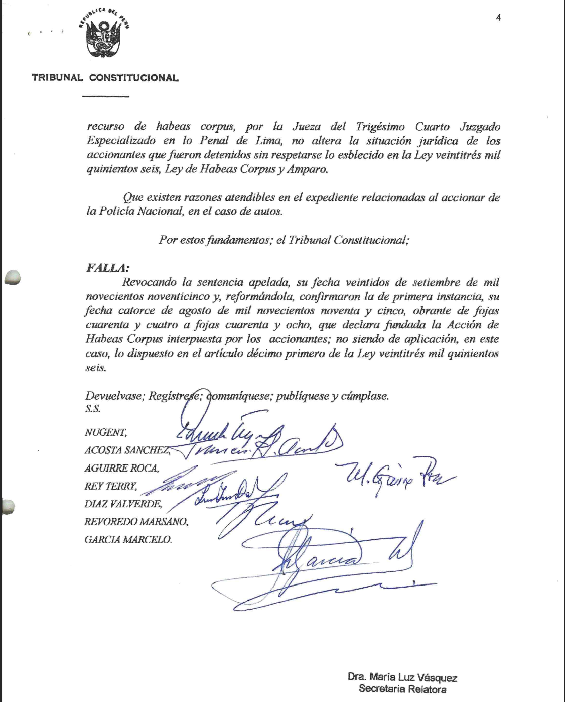
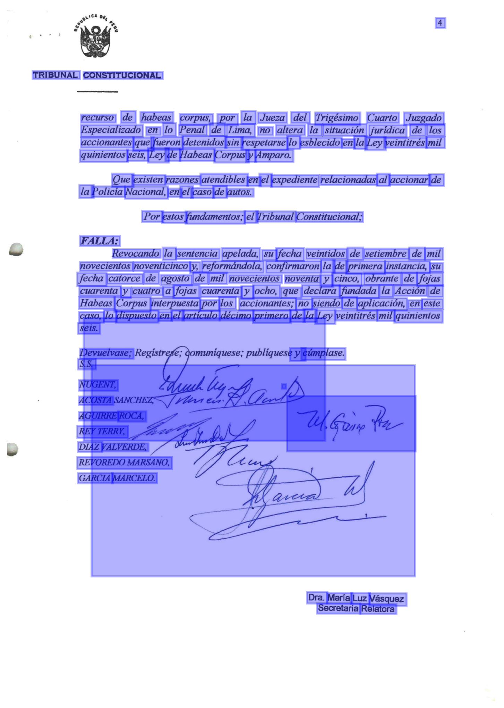

# aLex - augmented Legal experience
## Context
Las sentencias del Tribunal Constitucional están disponibles en el  [portal de búsqueda](https://jurisprudencia.sedetc.gob.pe/sistematizacion-jurisprudencial/busqueda)

Este portal agrupa información de las sentencias de acuerdo permitiendo una búsqueda basada en la siguiente estructura.
```json
{
   "_id":"37385",
   "_index":"sentencias",
   "_score":null,
   "_source":{
      "attachment":{
         "content":"TRIBUNAL CONSTITUCIONAL \n\n• \n\nExp. ... \n\n• \n\n\n\t\t2017-04-11T16:25:14",
         "content_length":7784,
         "content_type":"application/pdf",
         "language":"es"
      },
      "fecha_publicacion":"1996-10-18",
      "fundamentos":[
         "Que el literal f) inciso veinticuatro, del artículo segundo de la Constitución Política del Estado, establece que nadie puede ser detenido sino por mandato escrito y motivado del Juez, o por orden policial en situaciones de flagrante delito, debiendo ser puesto el detenido a disposición del Juzgado dentro de las veinticuatro horas, o en el término de la distancia, aún en el supuesto que la detención se debiera a mandato judicial o flagrante delito.",
         "Que en el caso de autos don Mario Tito Uribe Zorrillo y doña Patricia Rubio Portocarrero, fueron detenidos contraviniéndose el precepto constitucional anteriormente mencionado; el hecho de haberse ordenado su libertad en mérito al recurso de habeas corpus, por la Jueza del Trigésimo Cuarto Juzgado Especializado en lo Penal de Lima, no altera la situación jurídica de los accionantes que fueron detenidos sin respetarse lo esblecido en la Ley veintitrés mil quinientos seis, Ley de Habeas Corpus y Amparo."
      ],
      "id":37385,
      "nombre_demandado":"Teniente de la Policía Nacional del Perú (Wilson Gálvez Arrascue) y otro",
      "nombre_demandante":"Martín Felipe Castro Talavera a favor de Mario Tito Zorrilla Uribe y otra",
      "numero_expediente":"00006-1996-HC",
      "sentencia_distrito":{
         "id":37,
         "nombre":"Distrito Judicial de Lima",
         "slug":"distrito-judicial-de-lima"
      },
      "sentencia_sala":{
         "id":3,
         "nombre":"Pleno",
         "slug":"pleno"
      },
      "slug":"00006-1996-hc",
      "url_archivo":"https://tc.gob.pe/jurisprudencia/1996/00006-1996-HC.pdf"
   },
   "_type":"_doc",
   "sort":[
      845596800000
   ]
}
```

Este tipo de estructura funciona bien para búsquedas básicas. Sin embargo, puede ser potenciada por el uso de LLM para extraer entidades nombradas y categorías adicionales.

## Process
A pesar que el campo `["_source"]["attachment"]["content"]` describa el contenido del documento, hemos encontrado que en la mayoría de documentos, este contenido no está disponible al 100%. Menos aún cuando el único formato disponible del documento a través de la web es un PDF que corresponde al escaneo del documento original. No existe contenido en HTML. Por ello, es necesario utilizar algún modelo de visión computacional para extraer el texto de cada página de los archivos PDF. 



En ese sentido se utilizó [DocTR](https://github.com/mindee/doctr) para extraer el texto y la posición de cada uno de las palabras en los documentos. Como resultado se tiene


Cuya salida tiene la siguiente estructura:
```
document
└───page
│   │   dimensions
│   │   language
│   │   orientation
│   │   page_idx
│   │
│   └───block
│   │   │   geometry
│   │   └───line
│   │        │   geometry
│   │        └───word
│   │            │   geometry    
│   │            │   conficence    
│   │            │   value                    
│   │            ....
│   └───block
│       │   geometry
│       └───line
│           │   geometry
│           └───word
│               │   geometry    
│               │   conficence    
│               │   value                    
│               
```

